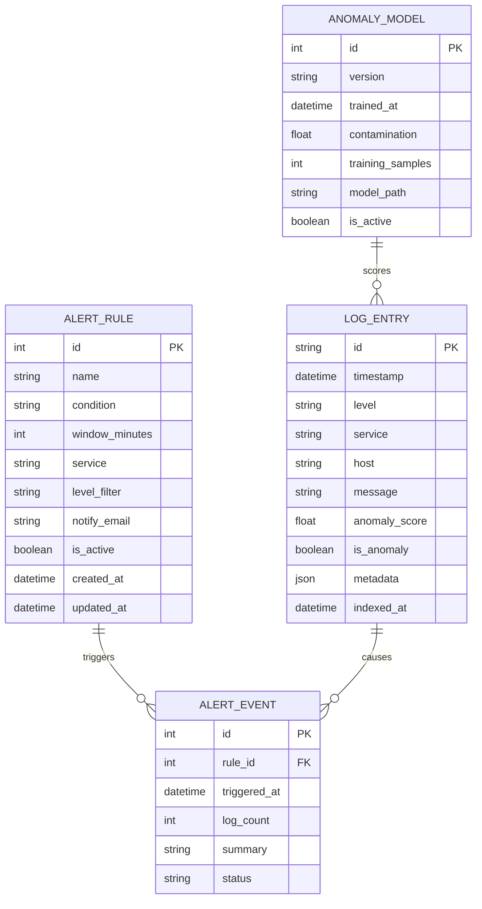

# Data Model — ER Diagram (Mermaid)



---

## Elasticsearch Index Schema

Index pattern: `logs-YYYY.MM.DD` (daily rollover for efficient time-based queries)

```json
{
  "mappings": {
    "properties": {
      "timestamp":      { "type": "date" },
      "level":          { "type": "keyword" },
      "service":        { "type": "keyword" },
      "host":           { "type": "keyword" },
      "message":        { "type": "text", "analyzer": "standard" },
      "anomaly_score":  { "type": "float" },
      "is_anomaly":     { "type": "boolean" },
      "metadata":       { "type": "object", "dynamic": true },
      "indexed_at":     { "type": "date" }
    }
  },
  "settings": {
    "number_of_shards": 3,
    "number_of_replicas": 1,
    "refresh_interval": "5s"
  }
}
```

---

## PostgreSQL Schema (for alerts and rules)

```sql
CREATE TABLE alert_rules (
    id          SERIAL PRIMARY KEY,
    name        VARCHAR(255) NOT NULL,
    condition   TEXT NOT NULL,
    window_minutes INT DEFAULT 5,
    service     VARCHAR(100),
    level_filter VARCHAR(20),
    notify_email VARCHAR(255),
    is_active   BOOLEAN DEFAULT TRUE,
    created_at  TIMESTAMP DEFAULT NOW(),
    updated_at  TIMESTAMP DEFAULT NOW()
);

CREATE TABLE alert_events (
    id          SERIAL PRIMARY KEY,
    rule_id     INT REFERENCES alert_rules(id),
    triggered_at TIMESTAMP DEFAULT NOW(),
    log_count   INT,
    summary     TEXT,
    status      VARCHAR(20) DEFAULT 'open'
);
```

---

## Kafka Topic Design

| Topic | Partitions | Retention | Description |
|---|---|---|---|
| `raw-logs` | 6 | 24 hours | Raw ingested log JSON from producers |
| `processed-logs` | 6 | 1 hour | Enriched logs with anomaly scores |
| `alerts` | 3 | 7 days | Alert events for notification workers |
